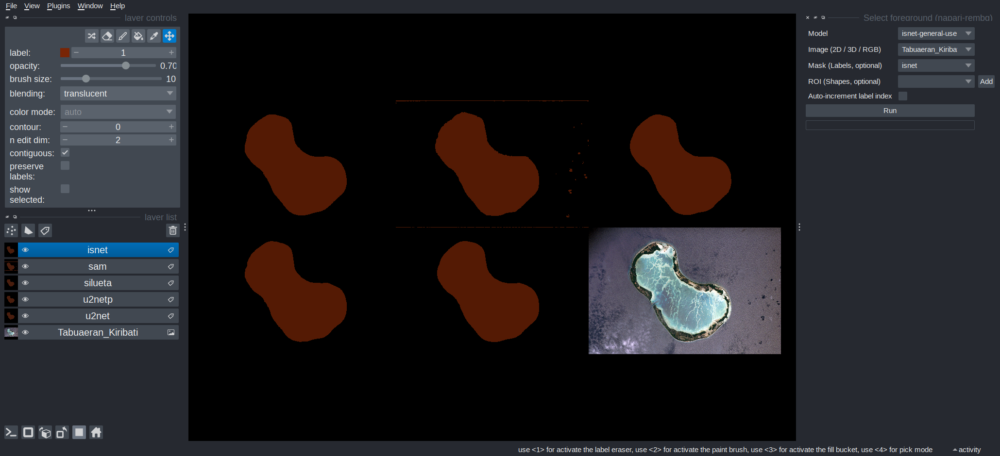

# napari-rembg

Segment the foreground of images using a collection of fast and lightweight generalist segmentation models in Napari. This plugin is based on the [rembg](https://github.com/danielgatis/rembg) project.


**Key features**

- Choose among **five generalist segmentation models**, including SAM (Segment Anything Model).
- Quickly annotate individual objects by drawing **bounding boxes** around them.
- Possibility to generate predictions via a remote **web API** and keep the installation lightweight on client machines.
- Compatible with 2D, RGB, 2D+t, and 3D images (slice by slice).

## Installation

You can install `napari-rembg` via [pip].

If you are planning to use your local machine for the predictions (most users):
~
    pip install "napari-rembg[local]"

If you wish to generate predictions from a [web api](#running-the-segmentation-via-a-web-api), go for a minimal install:

    pip install napari-rembg

## Models

- [u2net](https://github.com/xuebinqin/U-2-Net): A pre-trained model for general use cases.
- [u2netp](https://github.com/xuebinqin/U-2-Net): A lightweight version of u2net.
- [silueta](https://github.com/xuebinqin/U-2-Net/issues/295): Same as u2net with a size reduced to 43 Mb.
- [isnet](https://github.com/xuebinqin/DIS): A pre-trained model for general use cases.
- [sam](https://github.com/facebookresearch/segment-anything): Segment Anything Model pre-trained for any use cases (`vit_b`)



The models automatically get downloaded in the user's home folder in the `.u2net` directory the first time inference is run.

- Draw bounding boxes to segment individual objects.
- Segment individual slices in 2D, 2D-RGB, 2D+time and 3D images
- Run the `rembg` microservice in a web API (using FastAPI), for example on a remote machine with GPU.


## Usage

Start `napari-rembg` from the `Plugins` menu of Napari:

```
Plugins > Napari Select Foreground > Select foreground
```

or run from the command-line

```
napari -w napari-rembg
```

### Segment an image loaded into Napari

Select your image in the `Image` dropdown and press `Run`.

The output segmentation gets written in the `Labels` layer selected in the `Mask` field. If no layer is selected, a new layer will be created.

### Segment individual objects by drawing bounding boxes

- Click on the `Add` button next to the `ROI` field. This will add a `Shapes layer` to the viewer.
- Click and drag bounding boxes into the image. Each time you draw a bounding box a segmentation will be generated in the region selected.


<!-- <p align="center">
    
</p> -->

You can choose to auto-increment the label index to distinguish individual objects. Deselect that option to annotate a single foreground class.

## Running the segmentation via a web API

You can run the `rembg` segmentation via a web API running independently in a `docker` container.

**Advantages**
- The segmentation can be run on a remote machine with optimization (e.g. GPU).
- The segmentation models will be downloaded inside the docker container instead of the user's file system.
- You can minimally install the package with `pip install napari-rembg` on the client's machine. This will *not* install the `rembg` library, and potentially avoid dependency conflicts or bugs.

**Setup**

See [these instructions](./src/rembg-api/README.md) on how to set up the docker container and web API.

**Usage**

Start `napari-rembg` from the `Plugins` menu of Napari:

```
Plugins > Napari Select Foreground > Select foreground (Web API)
```

## Related projects

If you are looking for similar generalist segmentation plugins, check out these related projects:

- [napari-sam](https://github.com/MIC-DKFZ/napari-sam)
- [napari-segment-anything](https://github.com/royerlab/napari-segment-anything)

## Contributing

Contributions are very welcome. 

## License

Distributed under the terms of the [BSD-3] license,
"napari-rembg" is free and open source software.

## Issues

If you encounter any problems, please file an issue along with a detailed description.

[napari]: https://github.com/napari/napari
[Cookiecutter]: https://github.com/audreyr/cookiecutter
[@napari]: https://github.com/napari
[BSD-3]: http://opensource.org/licenses/BSD-3-Clause
[cookiecutter-napari-plugin]: https://github.com/napari/cookiecutter-napari-plugin
[pip]: https://pypi.org/project/pip/
[PyPI]: https://pypi.org/

----------------------------------

This [napari] plugin was generated with [Cookiecutter] using [@napari]'s [cookiecutter-napari-plugin] template.
